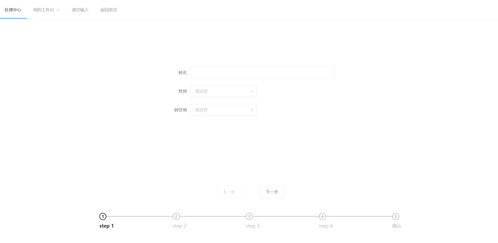
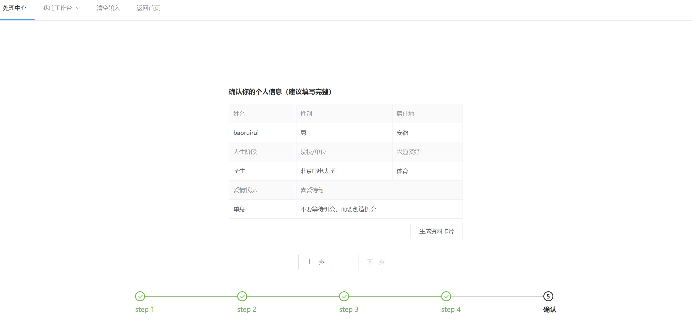

# question

## Project setup

```
pnpm install
```

### Compiles and hot-reloads for development

```
pnpm run dev
```

### Compiles and minifies for production

```
pnpm run build
```

### Lints and fixes files

```
pnpm run lint
```

### 功能演示

- step 1
  填写基本信息表单
  

- step 2
  检查信息并确认提交
  

- step 3
  查看个人资料卡片
  

- step 4
  点击卡片下方详情按钮，查看更多
  
  
  
  
